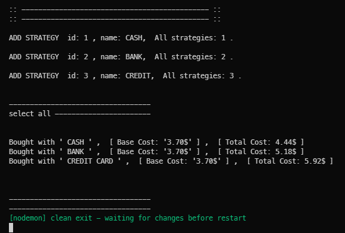
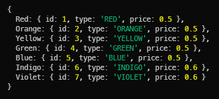

# DESIGN PATTERNS

 Jump to [Index](#index) ,
 class repo: [Assignment3JS](https://github.com/davidoster/Assignment3JS)


<br>

<br>

<br>

<br>

😎

# Clone [repo](https://github.com/demetreades/Assignment3JS.git)

      git clone https://github.com/demetreades/AssignmentJS3.git

`cd` into proper folder 

`npm run` to get the list of available scripts

`npm start`


<br>

# QUICKSTART

<br>

### files

`main.js` is the main file that starts and you will call your declared strategies, 

`./src/models/strategies.js` is the file with the initial strategies that can be modified as needed.

`./src/models/attributes/main.js` is the file with the attribute objects { colors, sizes, fabrics } that needed to make a TShirt with diffrent price for each attribute, where you can set get alter and add new attributes for the overall materials


<br>

### shop

The `shop` object is the main object that can `add` by creating a new strategy 
or`select` a strategy from a list of available strategies and on this selection 
give an order of one or many `TShirst` items and `execute` that strategy as a payment method.

      //  EXECUTES
      shop.select(1).execute();
      shop.select(2).execute();
      shop.select(3).execute();


<br>

 


<br>

<br>


### Index

<br>

- [Clone and setup](#Clone-and-setup)
  - [QUICKSTART](#quickstart)
    - [shop](#shop)
    - [files](#files)
    - [main](#main)
  - [Scripts](#scripts)
  - [Folder structure](#folder-structure)
- [Attributes](#attributes)
  - [sizes](#sizes)
  - [colors](#colors)
  - [fabrics](#fabrics)
- [Formatting initial DATA](#formatting-initial-data)
  - [DATA_Factory methods](#data-factory-methods)
  - [attributes main.js](#attributes-mainjs)
- [Payment strategy](#payment-strategy)
  - [new StrategyManager](#new-strategymanager)
    - [StrategyManager methods](#strategymanager-methods)
  - [new Strategy](#new-strategy)
    - [Strategy methods](#strategy-methods)
- [Modules](#modules)
    - [main.js](#main-js)
    - [Strategies](#strategies)
    - [Attributes](#attributes)

<br>

<br>


## Scripts

`npm run` for listing available scripts from `package.json` 

      "scripts": 
      {

      "start": "nodemon main.js",

      "attribute": "nodemon ./src/models/attributes/main.js",
      "manager": "nodemon ./src/models/manager.js",

      "strategy": "nodemon ./src/models/strategy.js",
      "strategies": "nodemon ./src/models/strategies.js",

      }

<br>


      npm run <<script>> 


<br>


## main

1. Strategy management main file

            ./main.js

2. Attributes managment main file

            ./src/models/attributes/main.js


<br>


## Folder structure


```
root >


      - main.js                     // [strategy] executable

      > src > assets  >

                      > img         // examples for markdown

      > src > models  >

                      > attributes  >

                                    - main.js  // [attributes] executable

                                    > models  > 
                                            
                                              - DATA_Factory.js

                                              - tshirt.js

                                              > factory > _DATA.js

                                              > factory > colors.js

                                              > factory > sizes.js

                                              > factory > fabrics.js
                      
                      > strategies  > 
                      
                                    > strategy1.js

                      - manager.js

                      - strategies            // available strategies

                      - strategy.js
                      
                    
```


<br>


## Attributes

{ size , color, fabric }

Attributes are the options that needed to be passed to TShirt to produce a tshirt object. 

Each attribute has a type property and a price property 

can be accessed with dot notation `fabrics.Wool.type`, `colors.Red.price`


<br>


## Formatting initial DATA

initial DATA are located at `./src/models/attributes/factory/_DATA.js`


`formatter` adds price for every attribute

function formatter(id, type, price)

      function formatter(id, type, price) {
        return { id: id, type: type, price: price };
      }

<br>

looper(factory, data, price)  ```// takes new DATA_Factory```

      function looper(factory, data, price) {
         for(item = 0; item < Object.keys(data).length; item++) {
         factory[Object.keys(data)[item]] = formatter(item+1, Object.values(data)[item], Object.values(price)[item]);
        }
      };

<br>

loop occures in every new DATA_Factory we call for each attribute and all export to `attribute's main.js` for producing tshirts.

<br>


 #### **sizes**

  
 
 #### **colors**

 

#### **fabrics**
 
 

<br>

data can be accessed via properties:

      fabrics.Linen.type   // 'LINEN'

      fabrics.Linen.price  // 2.7

      colors.Indigo.type   // 'INDIGO'

      colors.Indigo.price  // 0.6


<br>


## DATA Factory methods

You can list, rename and set new attributes in `./src/models/attributes/main.js`
here the basic attribute objects are created to be passed as arguments for creating a tshirt

if you use `TShirtGenerator()` you will create a `stock`  object with all tshirt variaties data from our given attributes that is exported to `./main.js`

      setAttribute(attribute :object, name :string, price :number)

      getAttribute(attribute.name)

      getAttribute(fabrics.Silk)

      getAttribute(sizies.L)

      listAttributes(...attributes) , Accepts multiple attributes

<br>


## attributes mainjs

attributes { fabrics, colors, sizes }

You can manipulate here attribute data and generate the tshirt stock with the available attributes.

      ./src/models/attributes/main.js


      npm run attribute 

<br>


## Payment strategy

You need to pass an `order` object to strategies so you can execute a purchase.

      ./main.js


      npm start

<br>


### new StrategyManager

`new StrategyManager()` produces the `shop` object that can add remove select a strategy from a list of available strategies

      ./models/manager.js


      npm run manager

<br>


### StrategyManager methods


<br>

      
      add(strategy)

Takes a new Strategy

Strategies are declared in `./src/models/strategies.js` the last argument of the `add()` method is a callBack so you can turn each new Strategy as code of block in every place is needed 

<br>

<br>


      remove(index)

Takes the index of a strategy

<br>

<br>


      select(index? string? () ) 

Selects a strategy from the list of available strategies.
With no argument lists all available options, with String selects the value that matches from the list of available strategies and with passing a number intiger selects by id.

<br>

      toString()


<br>


### new Strategy

`new Strategy(index, name, order, callBack)`

new Strategies are declared in `./src/models/strategies.js`


      ./models/strategy.js


      npm run strategy

<br>


<br>


#### Strategy methods


<br>

      execute() 
      
Executes the strategy by chaining after a succesful selection via `select()` method of an available strategy from `./src/models/strategies.js` or any newly added strategies from `add()` method.

<br>

      buyOneTShirt(index , stock: tshirts object)


Buys a single tshirt by `id` from `stock`, can be pass as argument in `add()` strategy

<br>


<br>

      toString()


<br>


### Modules
#

#### main js

Main app, execute strategies from here

{ stock, shop } -> main.js -> X

<br>


### Strategies
#


#### manager.js
`shop` creates here and exports to strategies

      X -> manager.js -> StrategyManager, 1shop

#### strategy.js
`Strategy` exports to `strategies.js` to be used as parameter on `add()`

      X -> strategy.js -> Strategy

#### strategies.js
create here new strategies on `shop` object

      { stock, 2shop } Strategy -> strategies.js -> 3shop


<br>


### Attributes
#

#### _DATA.js
Initial `DATA` price added

      X -> _DATA.js -> { 
            COLOR_DATA COLOR_PRICE, 
            SIZE_DATA, SIZE_PRICE, 
            FABRIC_DATA 
            FABRIC_PRICE 
      }

#### DATA_Factory.js
`DATA` formatting

      _DATA { ALLDATA } TShirt -> DATA_FACTORY -> { 
            DATA_Factory, 
            formatter, 
            looper, 
            getAttribute, 
            setAttribute, 
            TShirtGenerator, 
      }

<br>


#### tshirt.js
exports `TShirst` to `DATA_Factory`

      X -> tshirt.js -> TShirt

<br>


#### sizies.js
creates `sizes` from `looper() DATA_Factory`

      DATA_Factory { 
            DATA_Factory, 
            SIZE_DATA, 
            SIZE_PRICE, 
            looper 
      } -> sizes.js ->
      
       _DATA {
            SIZE_DATA, 
            SIZE_PRICE 
      } -> sizes.js

<br>


#### colors.js
creates `colors` from `looper() DATA_Factory`

      DATA_Factory { 
            DATA_Factory, 
            looper 
      } -> colors.js 

      _DATA {
            COLOR_DATA, 
            COLOR_PRICE 
      } -> colors.js

<br>


#### fabrics.js
creates `fabrics` from `looper() DATA_Factory`

      DATA_Factory { 
            DATA_Factory, 
            FABRIC_DATA, 
            FABRIC_PRICE, 
            looper 
      } -> fabrics.js

       _DATA {
            FABRIC_DATA, 
            FABRIC_PRICE 
      } -> fabrics.js

<br>


#### main.js
creates `stock` from `TShirtGenerator()`


      DATA_Factory { TShirtGenerator } -> attributes main.js -> stock

<br>

<br>


<br>

---

Back to [Index](#index).
