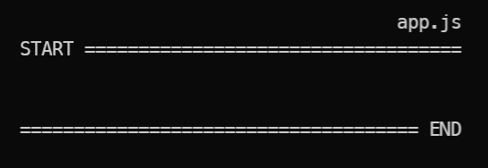
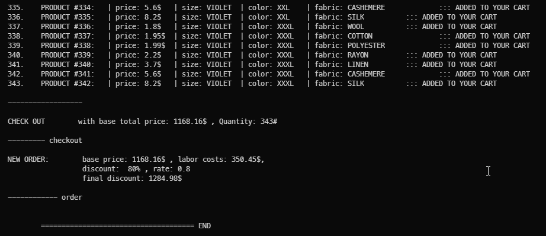
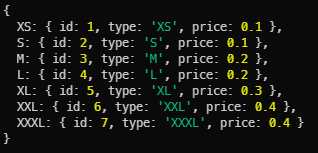
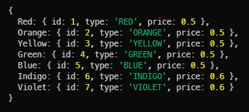
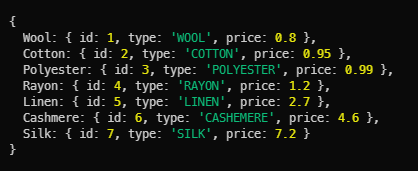
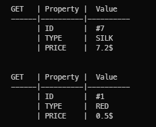
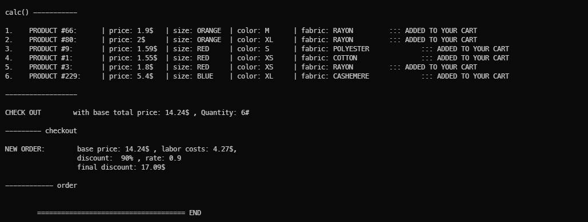
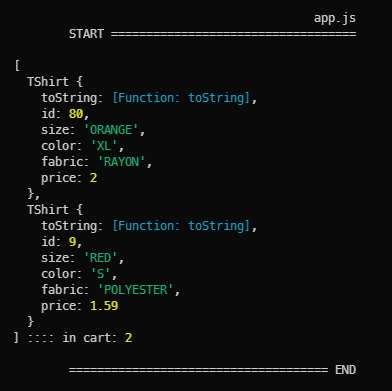

# DESIGN PATTERNS

 Jump to [Index](#index) ,
class repo: [Assignment3JS](https://github.com/davidoster/Assignment3JS)

 

 

 

 

😎

# Clone and start

      git clone https://github.com/demetreades/AssignmentJS3.git

`cd` into proper folder 

`npm run` to get the list of available scripts

`npm i && npm start`

.

 

# QUICKSTART

Start from `app.js` by running `npm start`

The buying / checkout method with a given discount is described in the examples.
Uncomment code snippets right under each Example title.
 

### files

`main.js` is the main file that starts via `start` command, you can create tshirts add them to a shopping card and checkout with a discount rate.

`./src/attributes/main.js` is the file with the attribute objects { colors, sizes, fabrics } that needed to make a `TShirt` with different price for each attribute, where you can set get alter and add new attributes for the overall materials.

### cart object

The `cart` object is the main object that can `add` items in your shopping cart and finally `checkout` with a given plan as a discount.

To create a `cart` object you need to pass a `Stock` object or any other array of `TShirt` objects as the list of current available products.
on `checkout` creates a `new Order` object witch that takes the payment strategy we apply and the `products` base price added from the `cart`.

 

 

 

### Index

 

- [Clone and start](#clone-and-start)
- [QUICKSTART](#quickstart)
  - [files](#files)
  - [cart object](#cart-object)
  - [scripts](#scripts)
- [Formatting initial DATA](#formatting-initial-data)
- [Attributes](#attributes)
  - [Attribute functions](#attribute-functions)
- [Cart manager](#cart-manager)
  - [Cart manager methods](#cart-manager-methods)

 

 

## scripts

`npm run` for listing available scripts from `package.json` 

      "scripts": {
      
      "start": "nodemon app.js",

      "attributes": "nodemon ./src/attributes/main.js",
      "loops": "nodemon ./src/attributes/factory/attributes.js"

      },

 

      npm run < script > 

 

## Formatting initial DATA

initial DATA are located at `./src/attributes/factory/_DATA.js`

`formatter` adds price for every attribute

 

formatter(id, type, price)

      function formatter(id, type, price) {
        return { id: id, type: type, price: price };
      }

 

factoryLoop(factory, data, price)  

      function factoryLoop(factory, data, price) {
         for(item = 0; item < Object.keys(data).length; item++) {
         factory[Object.keys(data)[item]] = formatter(item+1, Object.values(data)[item], Object.values(price)[item]);
        }
      };

 

 #### **sizes**

  
 
 #### **colors**

 

#### **fabrics**
 
 

 

Attribute's data can be accessed via its properties:

      fabrics.Linen.type   // 'LINEN'

      fabrics.Linen.price  // 2.7

      colors.Indigo.type   // 'INDIGO'

      colors.Indigo.price  // 0.6

 

 

## Attributes

{ size , color, fabric }

Attributes are the options that needed to be passed into TShirt to produce a tshirt object. 

Each attribute has a type property and a price property 

can be accessed via dot notation `fabrics.Wool.type`, `colors.Red.price`

 

### Attribute functions

- You can list, rename and set new attributes in `./src/attributes/main.js`
Basic attribute objects are created here to be passed as arguments for creating a tshirt.

 

`./src/attributes/factory/utilities.js`

      setAttribute(attribute :object, name :string, price :number)

      getAttribute(attribute.name)

      getAttribute(fabrics.Silk)

      getAttribute(sizies.L)

      listAttributes(...attributes) , Accepts multiple attributes

 

getAttribute(fabrics.Silk)

getAttribute(colors.Red)

 

### Cart manager

      ./src/models/cart.js

      ./src/models/order.js

`Cart` produces the `cart` object that takes a `Stock` object and adds items into products array and `checkout` by creating a  `new Order`.

`Order` calculates total attribute cost per item with labor and the given discount on checkout.

 

### Cart manager methods

 

      calc()            //  updates total cart's amount after each addition 
      

      add(product)      //  adds product in the products array

      check(index)      //  returns the indexed item
      

      buyAll(rate)      //  add all available products into products array
                        //  and checkouts with a given discount as a precentage
                        //  rate 0 to 100

      itemsChecked()    //  lists all added products in products array

      checkOut(rate)    //  creates a new Order with a discount as rate
                        //  and empties products array
                        //  rate 0 to 100

 

`checkOut(90)`

 

`itemsChecked()`

 

 

 

 

---

Back to [Index](#index).
