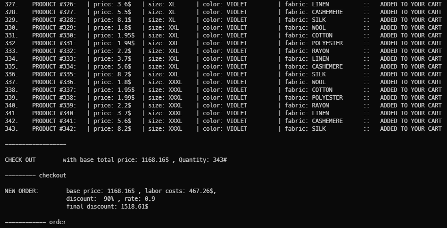

# DESIGN PATTERNS

Jump to [Index](#index) , class repo: [Assignment3JS](https://github.com/davidoster/Assignment3JS).

 

 

 

 

😎

# Clone and start

      git clone https://github.com/demetreades/AssignmentJS3.git

`cd` into proper folder.

`npm run` to get the list of available scripts.

`npm i && npm start`

 

# QUICKSTART

Start from `app.js` by running `npm start`

The buying / checkout method with a given discount is described in the examples. Uncomment code snippets right under each Example title.  

### files

`main.js` is the main file that starts via `start` command, you can create tshirts add them to a shopping cart and checkout with a discount rate depended the materials and labor rate.

`./src/attributes/main.js` is the file with the attribute objects { colors, sizes, fabrics } that needed for making a `TShirt` with different prices for each attribute, where you can set get alter and add new attributes.

### cart object

The `cart` object is the main object that can `add` items in your shopping cart and finally `checkout` with a given plan as a discount.

To create a `cart` object you need to pass a `Stock` array or any other array of `TShirt` objects as the list of current available products. on `checkout` creates a `new Order` object witch that takes the payment strategy we apply and the `products` base price added from the `cart`.

 

`cart.buyAll(90);`

 

### Index

 

- [Clone and start](#clone-and-start)
- [QUICKSTART](#quickstart)
  - [files](#files)
  - [cart object](#cart-object)
  - [scripts](#scripts)
- [Formatting initial DATA](#formatting-initial-data)
- [Attributes](#attributes)
  - [Attributes utilities functions](#attributes-utilities-functions)
- [Cart manager](#cart-manager)
  - [Cart manager methods](#cart-manager-methods)

 

.

 

## scripts

`npm run` for listing available scripts from `package.json`.

      "scripts": {

      "start": "nodemon app.js",

      "attributes": "nodemon ./src/attributes/main.js",
      "loops": "nodemon ./src/attributes/factory/attributes.js"

      },

 

      npm run < script >

 

## Formatting initial DATA

initial DATA are located at `./src/attributes/factory/_DATA.js`

`formatter` takes to parameters `ATTRIBITE_DATA`, `ATTRIBITE_PRICE` and creates a new object that adds a named property in proper case that includes id, type, and price as properties for every attribute in `_DATA`.

 

    const formatter = (id, type, price) => ({ id, type, price });

 

    const factoryLoop = (object, data, price) => {
    	Object.values(data).forEach((value, index) => {
    		object[Object.keys(data)[index]] = formatter(
    			index + 1,
    			Object.values(data)[index],
    			Object.values(price)[index],
    		);
    	});

    	return object;
    };

 

### **sizes**

### **colors**

### **fabrics**

 

Attribute's data can be accessed via its properties:

      fabrics.Linen.type;   //  'LINEN'

      fabrics.Linen.price;  //  2.7

      colors.Indigo.type;   //  'INDIGO'

      colors.Indigo.price;  //  0.6

 

 

## Attributes

{ size , color, fabric }

Attributes are the options that needed to be passed into `TShirt` to produce a tshirt object.

Each attribute has a type property and a price property that can be accessed via dot notation.

      fabrics.Wool.type  //  'WOOL'

      colors.Red.price   //  0.5

      sizes.XS.type      //  'XS'

 

### Attributes utilities functions

- You can list, rename and set new attributes at `./src/attributes/main.js` Basic attribute objects are created here to be passed as arguments for creating `new TShirt`.

 

`./src/attributes/factory/utilities.js`

      setAttribute(attribute :object, name :string, price :number);

      getAttribute(attribute.name);

      getAttribute(fabrics.Silk);

      getAttribute(sizies.L);

      listAttributes(...attributes);       //   Accepts multiple attributes

 

`getAttribute(fabrics.Silk);`

`getAttribute(colors.Red);`

 

### Cart manager

      ./src/models/cart.js

      ./src/models/order.js

`Cart` produces the `cart` object that takes a `Stock` array and adds items into products array and `checkout` by creating a `new Order`.

`Order` calculates total attribute cost per item with labor and the given discount on checkout.

`TShirt` Produces one or multiple tshirt objects that can be passed to `cart` for checkout.

      // range: 7 as the attribute's array length

      randomTShirtGenerator(range, colors, sizes, fabrics);

      TShirtGenerator(array, colors, sizes, fabrics);

 

### Cart manager methods

 

      cart              //  The object

      --------------    //  methods    --------------------------------------

      calc()            //  updates total cart's amount

      add(product)      //  adds product in the products array

      check(index)      //  returns the indexed item and pushes it into the products array

      buyAll(rate)      //  adds all available products into products array
                        //  and checkouts with a given discount as a precentage
                        //  rate 0 to 100

      itemsChecked()    //  lists all pushed products into products array

      checkOut(rate)    //  creates a new Order withdiscount rate
                        //  completes the purchase and empties products array
                        //  rate 0 to 100

 

`cart.checkOut(90);`

 

`cart.itemsChecked();`

 

 

 

.

---

Back to [Index](#index).
